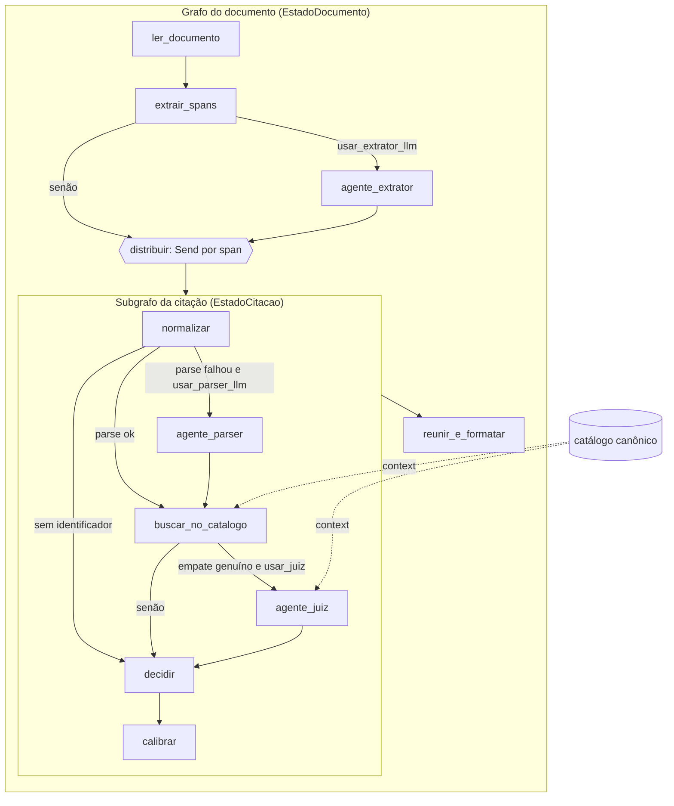

# Arquitetura

Pipeline híbrido orquestrado com **LangGraph**: a maior parte dos nós é
determinística (regex, catálogo, regras), e os três agentes LLM entram só por
arestas condicionais, desligados por padrão até a análise de erro justificar.

## Visão geral

Há duas etapas:

1. **Offline (uma vez):** construir o catálogo canônico a partir de
   `desafio1_bracis.db`. Fica fora do grafo.
2. **Por documento:** um grafo que extrai as citações e dispara um subgrafo
   independente para cada uma.

## Por que dois níveis

- As citações são independentes entre si. O `Send` do LangGraph distribui
  cada span para o subgrafo e um reducer (`operator.add`) junta os
  resultados. Cada citação tem rastro próprio, o que facilita o quadro de erros.
- A ordem de chegada não é garantida: `reunir_e_formatar` ordena por `inicio`.
- O subgrafo pode ser testado e avaliado sozinho, com os trechos do
  gabarito como entrada (modo `resolucao` da avaliação).

## Onde fica cada coisa

| Pasta | Conteúdo | Observação |
|---|---|---|
| `src/citacoes/grafo/` | estados, montagem dos dois grafos, funções de roteamento | só orquestração, sem regra de negócio |
| `src/citacoes/nos/` | um arquivo por nó | funções puras: recebem o estado, devolvem atualização parcial |
| `src/citacoes/agentes/` | modelo, schemas de saída estruturada, os três agentes | `prompts/` guarda os prompts em arquivos de texto |
| `src/citacoes/catalogo/` | construção offline e carga do catálogo | produz `artifacts/` |
| `src/citacoes/dominio/` | léxico jurídico, chave-esqueleto, injetor de ruído | compartilhado por extração e resolução |
| `src/citacoes/avaliacao/` | métrica local, os três modos, portão de regressão | a métrica oficial é a fonte da verdade |

## Nós

| Nó | Entrada | Saída | Tipo |
|---|---|---|---|
| `ler_documento` | caminho | `texto` exato (sem normalizar) | determinístico |
| `extrair_spans` | `texto` | lista de spans candidatos, sem distratores | determinístico |
| `agente_extrator` | janelas em torno de gatilhos sem span | spans extras (`origem=llm`) | LLM, opcional |
| `normalizar` | um span | campos estruturados + chave-esqueleto | determinístico |
| `agente_parser` | trecho + contexto | os mesmos campos estruturados | LLM, opcional |
| `buscar_no_catalogo` | campos | candidatos + conflitos de atributo | determinístico |
| `agente_juiz` | candidatos empatados + contexto | um id ou nenhum | LLM, opcional |
| `decidir` | candidatos | classe + id | determinístico |
| `calibrar` | sinais da decisão | confiança | determinístico (tabela em `params/`) |
| `reunir_e_formatar` | todas as citações | JSON 1.2 do documento | determinístico |

Regra de decisão (em `decidir`):

| Situação | Classe |
|---|---|
| sem identificador | incompleta |
| candidatos existem, mas todos têm conflito duro | inventada |
| 0 compatíveis | inventada |
| 1 compatível | real |
| 2+ compatíveis (e o juiz não decidiu) | incompleta |

Na dúvida entre real e inventada, "incompleta" é a pior aposta pela métrica.

## Convenções do LangGraph

- **Catálogo e parâmetros no contexto, não no estado.** Use
  `StateGraph(..., context_schema=Contexto)` e leia via
  `runtime.context` no nó. Assim os 1.016 registros não são copiados a cada
  passo.
- **Flags dos agentes no contexto:** `usar_extrator_llm`, `usar_parser_llm`,
  `usar_juiz`, todas `False` por padrão.
- **Nós devolvem só o que mudaram.** Listas acumuladas usam
  `Annotated[list, operator.add]`.
- **Nós não chamam outros nós.** Toda ramificação é aresta condicional em
  `grafo/`.
- **Lote:** `grafo.batch(documentos, ...)`. Com agentes LLM ligados,
  concorrência 1.
- **Sem checkpointer** no pipeline final (processamento em lote, sem
  retomada). Pode ser útil para depurar localmente.

## Agentes LLM

- Modelo local via `ChatLlamaCpp` (`langchain-community`), carregado uma vez
  e passado pelo contexto.
- Saída sempre por `with_structured_output(Schema)`, com schemas pydantic em
  `agentes/`. O agente nunca decide classe nem confiança; só preenche campos
  (parser), propõe spans (extrator) ou escolhe entre ids dados (juiz).
- Determinismo: `temperature=0` e **seed explícita** (o padrão do
  `ChatLlamaCpp` é `-1`, ou seja, aleatória), contexto e lote fixos, modo de
  raciocínio desligado.
- Candidato atual: Gemma 4 26B-A4B QAT em GGUF Q4_0. Pesos fora do git,
  baixados por script com revisão fixada.
- Rastreamento em nuvem pode ser usado só no desenvolvimento local. No
  bundle, a execução é sem rede e o log vai para JSONL local via callbacks.

## Custo do LangGraph

Com os três agentes desligados, o grafo é só uma sequência de funções. O
custo é pequeno e o ganho é poder ligar os agentes sem reestruturar nada.
Mantendo os nós como funções puras, eles continuam testáveis sem o grafo.
